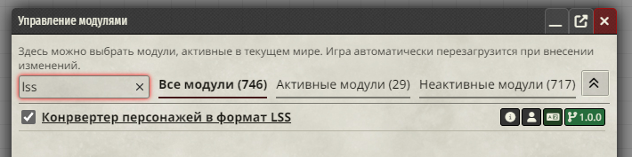
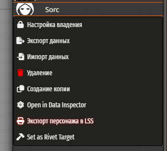
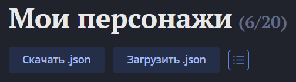

# Экспорт персонажа в формате Long Story Short
Этот модуль для Foundry VTT позволяет экспортировать персонажей в формате [Long Story Short](https://longstoryshort.app/characters/list/).

# Установка
Чтобы установить модуль, выполните следующие действия:

1. На главном экране Foundry VTT откройте вкладку "Модули"(Add-on Modules).
2. Нажмите на кнопку "Установка модуля"(Install Module).
3. Найти модуль в списке доступных 
   Либо в строке "URL манифеста"(Manifest URL) вставьте ссылку: `https://github.com/Elfrey/elfrey-lss-converter/releases/latest/download/module.json`
5. Нажмите "Установить"(Install) и дождитесь завершения установки.
 
# Использование
1. В списке модулей включите модуль "Конвертер персонажей в формат LSS".

2. Откройте вкладку актёров, нажмите правой кнопкой на актера и нажмите "Экспорт персонажа в LSS".

3. Сохраните файл.
4. Перейдите на сайт [Long Story Short](https://longstoryshort.app/characters/list/), зайдите в раздел "Мои Персонажи" и нажмите "Загрузить .json".
 

